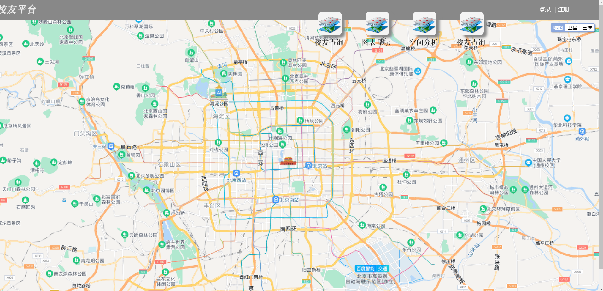
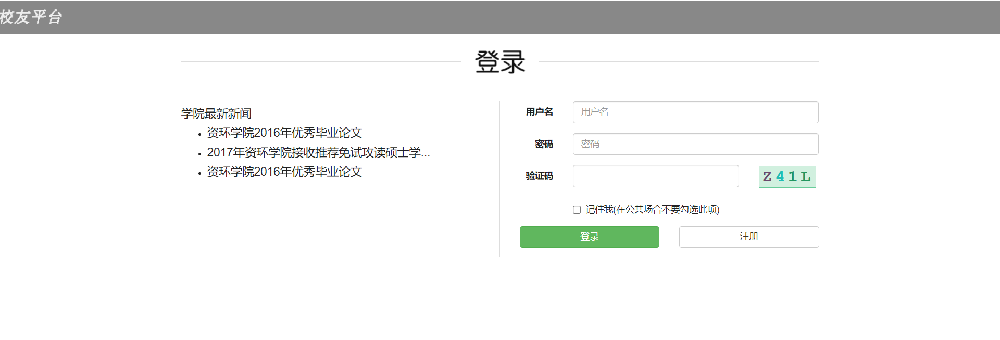
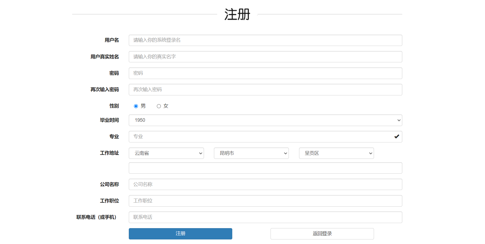

This is an alumni platform written in 2017 based on the Spring Web MVC framework
You could clone the repository and start your travel from [index page](./WebRoot/public/index.html)

The platform implements functions such as user registration, user search, data management, geographic search, etc.

